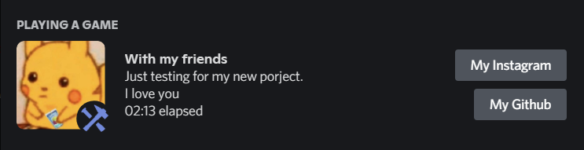

## Discord Rich Precense

Make you're activity great again!

## Setup:

Please make sure to full the blanks in config.json:

```js
{
  "clientId": "", // you're app id
  "details": "", // activity's title
  "state": "", // activity's description
  "largeImage": "", // put the name of the image that you uploaded it, It'll be large image
  "largeImageText": "", // when you hover the image, this text will shown
  "smallImage": "", // the same goes with this
  "smallImageText": "", // and this
  "buttons": {
    "buttonOneLabel": "", // button one text
    "buttonOneUrl": "", // button one url
    "buttonTwoLabel": "", // button two text
    "buttonTwoUrl": "" // button two url
  }
}
```

you can upload images from https://discord.com/developers/applications/your-app-id/rich-presence/assets

Example:

```json
{
  "clientId": "872399889160618005",
  "details": "Just testing for my new porject.",
  "state": "I love you",
  "largeImage": "meme",
  "largeImageText": "cute right?",
  "smallImage": "discordmods",
  "smallImageText": "lol",
  "buttons": {
    "buttonOneLabel": "My Instagram",
    "buttonOneUrl": "https://www.instagram.com/1xm0d/",
    "buttonTwoLabel": "My Github",
    "buttonTwoUrl": "https://github.com/tyizo/"
  }
}
```



## How to run this:

- Download and unzip/clone the repo
- After that go to the location of this repo and, `yarn install`
- run the script by, `node index.js`
